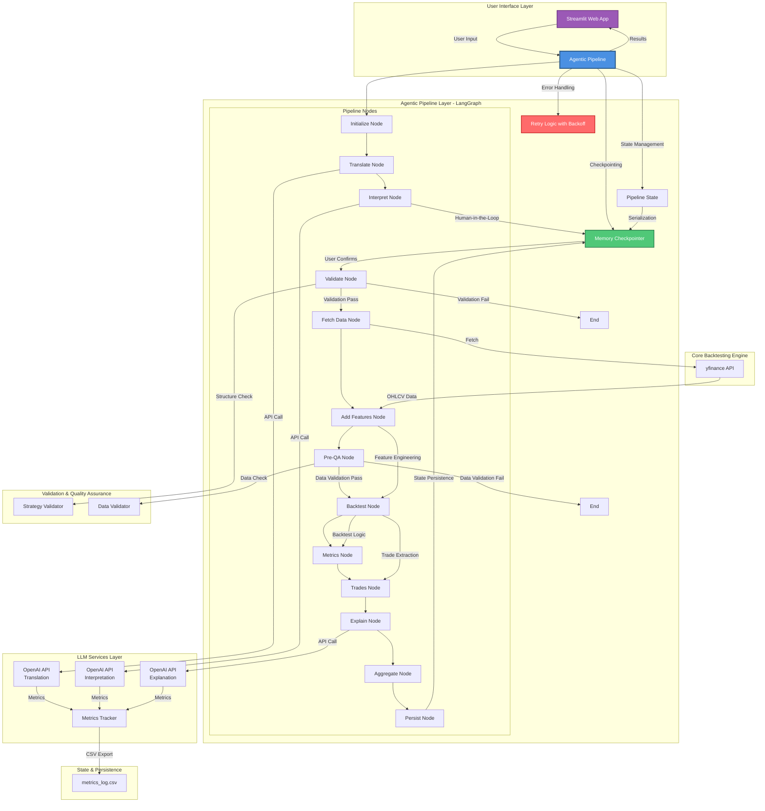
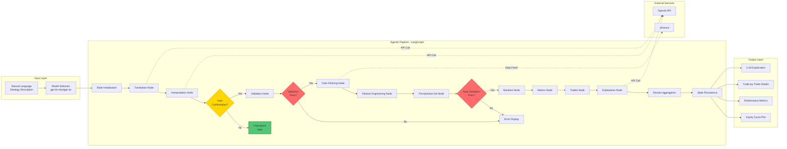
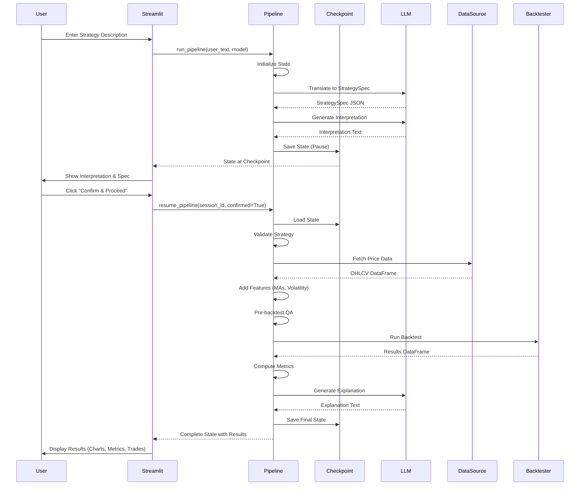

# Backtest Chat Copilot - Architecture Diagram

## System Architecture



## Detailed Component Architecture



## Data Flow Architecture



## Key Benefits of This Architecture

### 1. **Agentic Pipeline Benefits**

#### ✅ **State Management & Persistence**
- **Benefit**: Complete state tracking across all pipeline stages
- **Impact**: Can resume from any point, debug issues easily, track execution history
- **Implementation**: LangGraph's built-in state management with checkpointing

#### ✅ **Human-in-the-Loop Integration**
- **Benefit**: User confirmation before expensive operations (data fetching, backtesting)
- **Impact**: Prevents wasted API calls and computation on incorrect interpretations
- **Implementation**: Checkpoint mechanism pauses before validation, waits for user confirmation

#### ✅ **Error Recovery & Retry Logic**
- **Benefit**: Automatic retries with exponential backoff for transient failures
- **Impact**: Higher reliability, better user experience, reduced manual intervention
- **Implementation**: Decorator-based retry logic for LLM calls and data fetching

#### ✅ **Conditional Routing**
- **Benefit**: Smart pipeline flow based on validation results
- **Impact**: Early failure detection, prevents unnecessary computation
- **Implementation**: Conditional edges in LangGraph based on validation status

### 2. **Modularity & Maintainability**

#### ✅ **Separation of Concerns**
- **Benefit**: Clear boundaries between UI, pipeline, LLM, and core logic
- **Impact**: Easy to modify, test, and extend individual components
- **Structure**: 
  - `app.py`: UI layer only
  - `pipeline/`: Agentic orchestration
  - `llm/`: LLM interactions
  - `core/`: Business logic

#### ✅ **Reusable Components**
- **Benefit**: Nodes can be reused, tested independently, or composed differently
- **Impact**: Faster development, easier testing, flexible architecture

### 3. **Observability & Debugging**

#### ✅ **Comprehensive Logging**
- **Benefit**: Track execution at every step with detailed logs
- **Impact**: Easy debugging, performance monitoring, cost tracking
- **Implementation**: Logging at node level, state tracking, metrics collection

#### ✅ **Metrics Tracking**
- **Benefit**: Track LLM usage (tokens, costs, latency) for all operations
- **Impact**: Cost optimization, performance analysis, usage monitoring
- **Implementation**: Automatic metrics logging to CSV

### 4. **Scalability & Performance**

#### ✅ **Efficient State Handling**
- **Benefit**: State only serialized when needed (checkpoints), DataFrames handled separately
- **Impact**: Faster execution, lower memory usage
- **Implementation**: Stream-based state capture, checkpoint optimization

#### ✅ **Parallel-Ready Architecture**
- **Benefit**: Nodes can be easily parallelized in future (e.g., metrics + trades)
- **Impact**: Potential for faster execution with concurrent processing

### 5. **User Experience**

#### ✅ **Progressive Disclosure**
- **Benefit**: Show interpretation first, get confirmation, then run expensive operations
- **Impact**: Better user trust, fewer errors, clearer expectations

#### ✅ **Error Resilience**
- **Benefit**: Graceful degradation - non-critical failures don't stop the pipeline
- **Impact**: Better user experience, partial results when possible

### 6. **Cost Optimization**

#### ✅ **Selective LLM Usage**
- **Benefit**: Only use LLM when needed, with model selection for cost/quality tradeoff
- **Impact**: Lower costs, faster execution with cheaper models when appropriate

#### ✅ **Retry Logic**
- **Benefit**: Automatic retry on transient failures reduces manual retries
- **Impact**: Lower operational overhead, better success rates

## Architecture Comparison

### Before (Sequential Streamlit)
```
User Input → Translation → Interpretation → [Manual Confirmation] 
→ Validation → Data Fetch → Backtest → Results
```
**Issues:**
- No state persistence
- No error recovery
- No retry logic
- Tightly coupled components
- Difficult to debug

### After (Agentic Pipeline)
```
User Input → [Agentic Pipeline with State Management]
→ Checkpoint → User Confirmation → Resume
→ [Error Recovery & Retries] → Results
```
**Benefits:**
- ✅ State persistence
- ✅ Automatic error recovery
- ✅ Retry logic
- ✅ Modular components
- ✅ Easy debugging
- ✅ Scalable architecture

## Technology Stack

| Layer | Technology | Purpose |
|-------|-----------|---------|
| **UI** | Streamlit | Web interface |
| **Orchestration** | LangGraph | Agentic pipeline |
| **State** | MemorySaver | Checkpointing |
| **LLM** | OpenAI API | Translation, interpretation, explanation |
| **Data** | yfinance | Market data |
| **Computation** | pandas, numpy | Data processing & backtesting |
| **Visualization** | matplotlib | Equity curves |
| **Metrics** | CSV | Logging & analysis |

## Key Design Decisions

1. **LangGraph over LangChain**: Better state management and human-in-the-loop support
2. **Checkpointing**: Enables resumability and user confirmation
3. **Stream-based execution**: Captures state even when checkpointing fails
4. **Shared checkpointer**: Singleton pattern ensures state persistence across instances
5. **Modular nodes**: Each node is independent and testable
6. **Error handling**: Retry logic for transient failures, graceful degradation for non-critical

## Future Enhancements

- **Parallel execution**: Run metrics and trades nodes concurrently
- **Database persistence**: Replace MemorySaver with database-backed checkpointer
- **Caching**: Cache LLM responses for similar strategies
- **Batch processing**: Process multiple strategies in parallel
- **Advanced analytics**: Add more sophisticated performance metrics
- **Multi-asset support**: Extend to portfolio strategies

